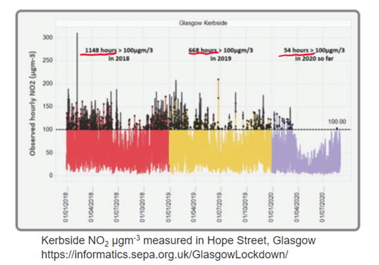
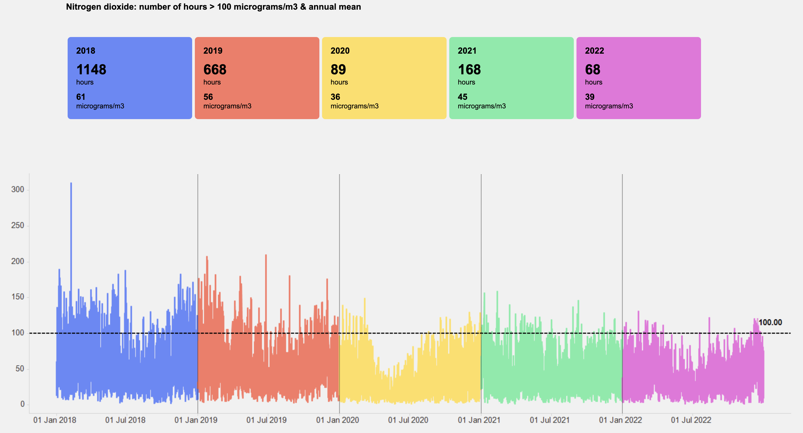
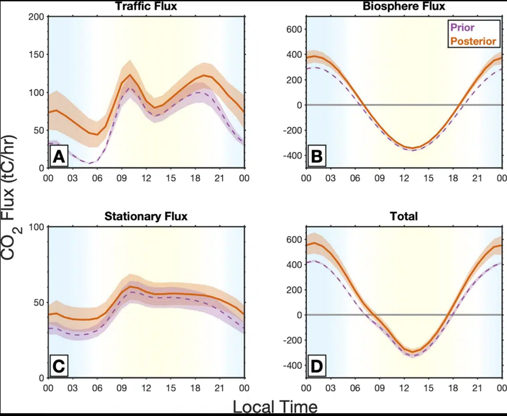
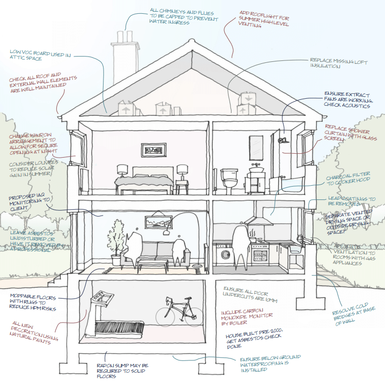
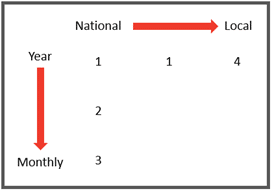

# Improving environmental decision making through data (GEMINOA)

In partnership with Glasgow City Council, this multidisciplinary project
combines novel outdoor air quality and emissions sensors, indoor air
quality data and economic analysis to support public engagement and aid
policy makers in evaluating and measuring the impact of policy.

Formally launched in October in the University’s Technology and Innovation Centre, the Glasgow Environmental Monitoring of Indoor and Outdoor Air (GEMINOA) project brings together researchers from across the University of Strathclyde, as well as local partners in [Glasgow City Council (GCC)](https://www.glasgow.gov.uk), [Glasgow Science Centre](https://www.glasgowsciencecentre.org/), [SmartSTEMs](https://smartstems.org/), and international partners from the University of California Berkeley to inform policy decision making and support public engagement.

The [Local Governments for Sustainability (ICLEI)](https://iclei.org/) funded project will run for two years facilitating collaboration between University of Strathclyde academics from the departments of Architecture, Electronic and Electrical Engineering (EEE) and Economics (Fraser of Allander Institute).

## Project overview

At the core of this project is an understanding that making positive societal change and tackling the big challenges of the future requires a collaborative and multidisciplinary approach. In partnership with UCBerkeley and GCC, the University of Strathclyde has deployed a network of air quality  sensors to measure levels of CO2, CO, NOx, PM2.5 and PM10 throughout the city. Alongside outdoor air quality measurement, the project will explore the complex relationship and interactions between indoor and outdoor air quality.

The project, in bringing together advances in measurement technologies with environmental and economic data, aims to equip local policy makers with a better understanding of measures of air quality across the city.In addition, we will develop an understanding of the links between indoor and outdoor measures as well as highlighting potential impacts of policies focused on air quality improvements, and how these policies can be effectively evaluated.

A central component of the project is showing how data can be used to support public engagement. Throughout the project we will be engaging with secondary schools across the city on air quality metrics and environmental and economic policy.

## What will we do?

### Outdoor Air Quality team

Led by Professor Craig Michie of the Electronic and ElectricalEngineering department the outdoor air quality team are translating novel modelling approaches developed at UC Berkeley to decouple the contribution to CO\(_2\) concentrations coming from biospheric and anthropogenic sources. In combination with meteorological data with allows a measure of the CO\(_2\) created within the City ofGlasgow to be made. This information can be compared with the empirical estimates of CO\(_2\) created from inventory data. The team will use this information, along with the other sensory data to develop material for outreach activity within the school and within the community. An illustrative example from previous work undertaken by SEPA shows the reduction in NO\(_2\) at a roadside monitoring station following the introduction of Phase 1 of the Low Emission Zone (**Figure 1**).

**Figure 1: Kerbside NO\(_2\) measurements within the LEZ**

[Glasgow LEZ Phase 2 (sepa.org.uk))](https://informatics.sepa.org.uk/GlasgowLezPhase2/)

During 2019 the duration where NO\(_2\) levels exceeded 100 μgm\(^-3\) fell from 1148 hours to 668 hours representing a significant improvement in local air quality. The impact of COVID during the following year shows the effect of the lockdown policy.

**Figure 2** below was created by researchers a UC Berkeley using data from the network of sensors located over Glasgow and shows a preliminary estimate of the CO\(_2\) generated by the city and by the bio-sphere.

**Figure 2: Preliminary Data from the Glasgow Sensor Network showing Traffic, Stationary and Biospheric contributions to CO\(_2\)**

The diurnal nature of the biospheric contribution to CO\(_2\) is clearly evident. What is also interesting is the fact that CO2 measurements appear to indicate that the contribution from the city is higher than would be estimated from the prior (inventory based) estimates. However, it should be stressed that this is preliminary work and more detailed calculations will be carried out over the following months to refine these figures.

The team are working with the Glasgow Science Centre, SmartSTEMs and Glasgow City Council to use this type of measurement data to engage with the local community and increase awareness and understanding of air quality across the city.

### Indoor Air Quality team

In the drive towards the net-zero carbon agenda our emphasis on improving the energy efficiency of our buildings has never been stronger. Led by Professor Tim Sharpe head of the department of Architecture, our indoor air quality team will explore the potential consequences that may arise from airtight energy efficiency building practices while trying to maintain ventilation to promote good air quality.

**Figure 3: Ventilation and insulation diagram**

*Source: Indoor Air Quality in Airtight Homes:
A Designer’s Guide*

In addition to the outdoor air quality sensors that are presently installed, specific locations throughout the city have been identified to investigate the interactions between indoor air quality and outdoor air quality data.

Indoor air quality sensors deployed at various Secondary schools within Glasgow will gather data to better understand the relationship between indoor/outdoor air quality and the effect of interventions such as making buildings more efficient to heat.

Outcomes will be demonstration of impacts and effects of indoor/outdoor exchange of pollutants, and demonstration of mitigation measures, for example, improved ventilation, controlled ventilation accounting for external air quality, occupancy awareness or air quality and pollution.

**Figure 4: Indoor and Outdoor air quality**

*Source:* *<https://pubs.acs.org/doi/10.1021/acs.est.0c05727>*

Measuring relevant parameters both indoor and outdoor will provide data to local authorities and housing associations as well as tenants and house owners enabling all parties to better understand the impact of changes. Ideally changes to building practice will result in better living conditions with a lower carbon footprint. The study will also examine unintended consequences of shifts in behavior and policy – for example the impact on indoor air quality from the use biofuels and wood burning stoves as a lower carbon heating source, or as mitigations for fuel poverty.

### Fraser of Allander

The Fraser of Allander contribution – led by Dr Grant Allan – to the GEMINOA project aims to have a data-led focus on the associations between economic factors and air quality and emissions metrics at the urban level.

Firstly, we will gather and review the granularity of economic, environmental, air quality and emissions data at the urban level in Glasgow which could support public engagement and policy evaluation. Going forward it is critical that we understand the current data landscape and the specific characteristics of available data that may be used to assess the impact of a given policy. The focus will specifically be on the geographic detail and timeliness of data – i.e., its frequency and “lags” between the period of time to which the data relates and its publication. **See Figure 5**.

**Figure 5: Temporal and geographic granularity of data**

*Source: FAI*

Secondly, we will build on the data gathering work by exploring past relationships between the range of data gathered at the first stage, to explore how economic, emissions and air quality metrics have changed over time and understand the current baseline and trajectory for the city. Our choice of focus will be informed by discussions with stakeholders in the project. One aspect could focus on the different metrics of emissions available to assess the level of emissions at the urban level, and how policies might impact differently on each metric. One such metric shown in **Figure 6** highlights the contribution that decarbonisation of the GB energy grid (solid green bar) has had on greenhouse gas estimates for Glasgow between 2005 and 2021.

**Figure 6: Structural decomposition of Local Authority Greenhouse Gas
estimates, Glasgow 2005-2021**

*Source: FAI calculations, BEIS/DESNZ*

Additionally, we aim to explore the links between socioeconomic data and air quality in Glasgow. Through this stream of work, we aim to understand how air quality differs across the city, and how it interacts with neighbourhoods characterised by higher levels of income inequality and poor health outcomes. This illustrates the way in which air quality affects people living in Glasgow, and deepens our understanding of the relationships between environmental policy action and social outcomes.

Finally, in partnership with GCC, we will explore the economic evaluation air quality and emissions interventions, showing how the impacts of previous interventions can be evaluated using economic techniques.

## Summary

This multidisciplinary project will bring together expertise from across the university and our partner institutions with the goal of supporting public engagement and aiding policy makers through data.

To follow the project as it progresses or to learn more details about what the project involves, visit the project page [here](https://geminoa.strath.ai).

The authors acknowledge funding from [Local Governments for Sustainability (ICLEI)](https://iclei.org/).
